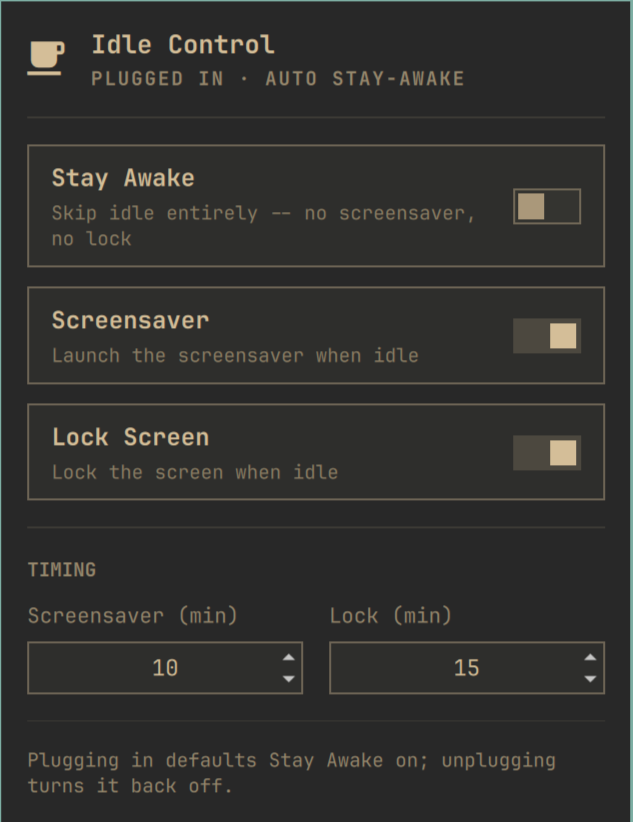
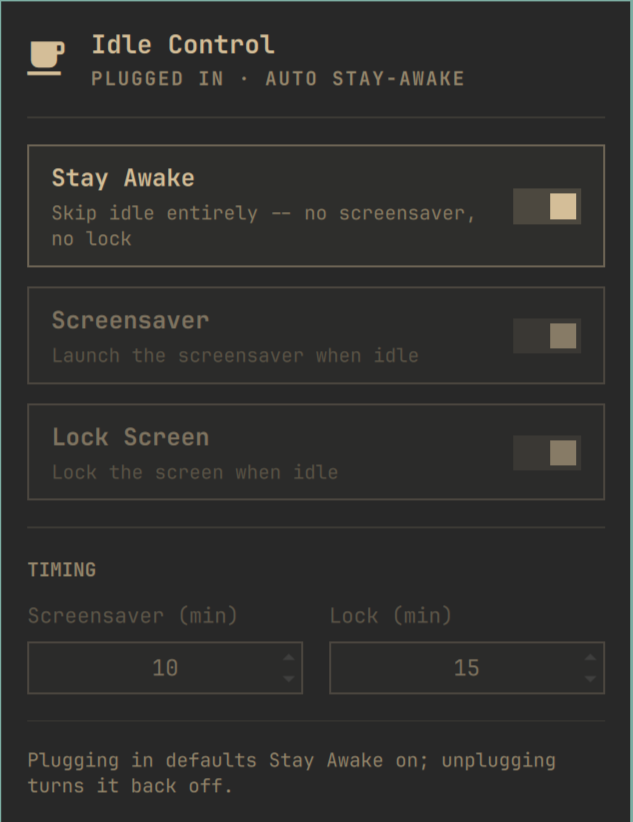

# Idle Control

A bar widget for [Omarchy](https://omarchy.org) that gives you three
independent switches over idle behavior — **Stay Awake**, **Screensaver**,
and **Lock Screen** — instead of Omarchy's built-in stay-awake toggle, which
bundles screensaver and lock together. It also lets you edit the
screensaver/lock idle timeouts directly from the panel, and auto-enables
stay-awake while you're plugged into AC power (and turns it back off when
you unplug), the way macOS Energy Saver does.



## Why

Omarchy already has a stay-awake indicator, but it's all-or-nothing: turning
it on disables the entire idle cycle, so you can't say "never lock, but
still let the screensaver run" or vice versa. This widget adds two more
independently-controllable flags on top of it, plus a bar icon that's always
visible (not just on hover) and a panel to flip everything without touching
a terminal.

The bar icon itself doubles as a status indicator — it turns red when Stay
Awake is on, so you can tell at a glance without opening the panel:


## What it does

Three flags, each optional and independent:

| Flag | What it controls | Backing mechanism |
|---|---|---|
| **Stay Awake** | Skips the entire idle cycle — no screensaver, no lock | Native Omarchy indicator (`~/.local/state/omarchy/indicators/stay-awake`) |
| **Screensaver** | Whether the screensaver launches when idle | Native Omarchy toggle (`omarchy toggle screensaver`) |
| **Lock Screen** | Whether idle triggers the lock screen | New toggle this project adds, via a small patch — see below |

None of these interrupt an idle timer that's already counting down; they're
gates checked at the moment the timer fires, not switches that immediately
lock/unlock/start/stop a screensaver. When Stay Awake is on, the other two
toggles (and the timeout fields) are shown disabled, since they wouldn't do
anything.

There's also a **Timing** section to set the screensaver/lock idle timeouts
in minutes directly from the panel, and an `ac-power-idle-sync` background
service that keeps Stay Awake in sync with whether you're on AC power —
plugged in defaults to Stay Awake on, unplugging turns it back off. A manual
override from the panel holds until the next plug/unplug transition.



## The system patch

Omarchy's screensaver already respects a toggle file
(`~/.local/state/omarchy/toggles/screensaver-off`) before launching on
idle — that mechanism already existed. Lock doesn't have an equivalent, so
giving Lock Screen its own toggle means changing one line in Omarchy's
own idle service, `/usr/share/omarchy/shell/plugins/services/idle/Service.qml`,
inside `lockSystem()`:

```diff
- runProcess(lockProcess, "lock", "omarchy-system-lock")
+ runProcess(lockProcess, "lock", "omarchy-toggle-enabled lock-off || omarchy-system-lock")
```

This only affects the idle-triggered lock path. Manually locking (menu,
`SUPER+CTRL+L`) calls `omarchy-system-lock` directly and is never touched.

This is a change to a file owned by the `omarchy` package, not something
under your own config. `install.sh` asks for confirmation before applying
it, keeps a backup (`Service.qml.bak-pre-lock-off`), and uses `pkexec` since
it needs root to edit a system path. **An `omarchy update` can overwrite
this file and silently drop the patch** — if that happens, Lock Screen just
goes back to always locking on idle (not broken, just stock behavior again);
re-run `install.sh` to reapply. You can decline this step during install and
use Stay Awake + Screensaver only; the Lock Screen toggle will still show up
but won't do anything until the patch is applied.

## Install

Requires Omarchy, `jq`, and `upower` (both are already present on a stock
Omarchy install).

```bash
git clone https://github.com/kuoforit/omarchy-idle-control.git
cd omarchy-idle-control
./install.sh
```

This installs:
- the plugin to `~/.config/omarchy/plugins/stevenkuo.idle-control/`
- three scripts to `~/.local/bin/`: `idle-control-status`,
  `idle-control-set-timeout`, `ac-power-idle-sync`
- a systemd user service (`ac-power-idle-sync.service`), enabled and started
- optionally, the Service.qml patch described above

Re-running `install.sh` is safe; every step is idempotent.

## Uninstall

```bash
./uninstall.sh
```

Removes the plugin, scripts, and systemd service, and offers to restore the
original `Service.qml` from backup if the patch was applied.

## Compatibility

Built and tested on Omarchy running on a MacBook 12" (2017), as of
2026-09-02. The `Service.qml` patch matches against an exact line of text —
if a future Omarchy release restructures that file, `install.sh` will detect
the mismatch and skip the patch rather than corrupt the file, and the rest
of the widget (Stay Awake + Screensaver + Timing) still works fine on its
own.

AC power detection looks for the first `/sys/class/power_supply/*` entry
with `type=Mains`, so it isn't tied to a specific device name like `ADP1`.

## License

MIT — see [LICENSE](LICENSE).
